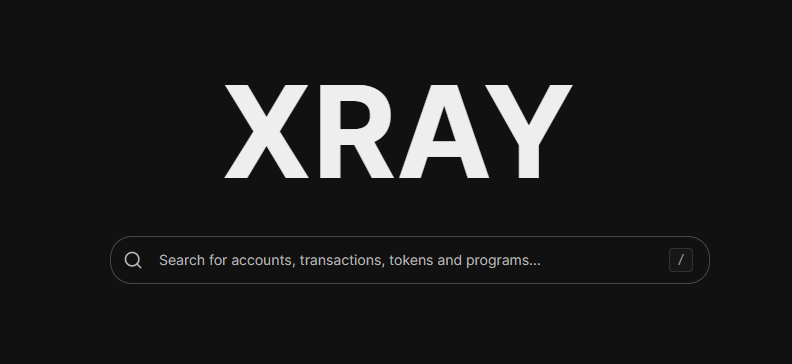

# XRAY

The human-readable Solana explorer.



## Getting Started

Install dependencies:

```bash
bun install
```

First, run the development server:

```bash
bun run dev
```

Open [http://localhost:3000](http://localhost:3000).

## License

Licensed under the [MIT license](LICENSE.md).
